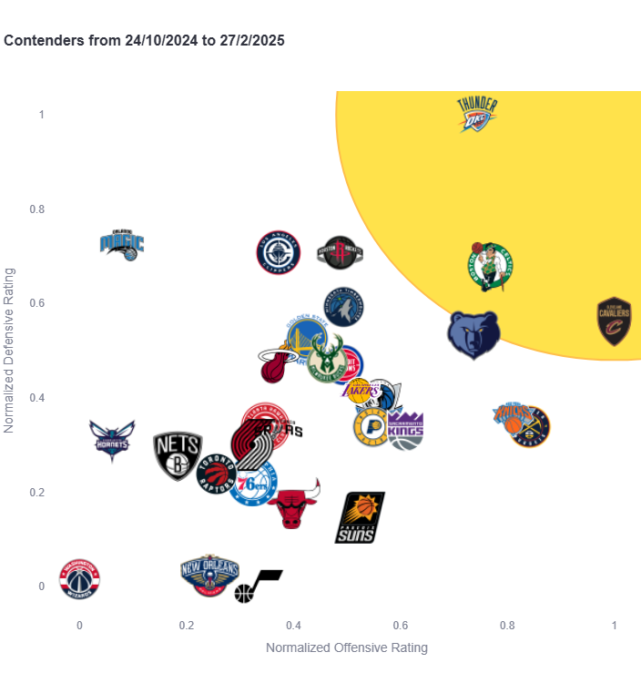

## Hi 👋 I'm Rémi Bounoua, 24  Data Scientist

I'm a passionate sports guy, I could talk about it for days. But I also am a Data Scientist.
I intend on merging my 2 passions in new and exciting ways. I try to find novel methods to tackle existing real world problems, share my findings in a digestible yet elegant manner and provide value to those who read it.

### Take a look at my latest project : ✨ The Contenders App ✨
A simple visual guide to spot NBA title contenders, with tools to select date intervals, extract pictures and build exciting storylines !

If you have questions or a winning lottery ticket, hit me up !

        
        

